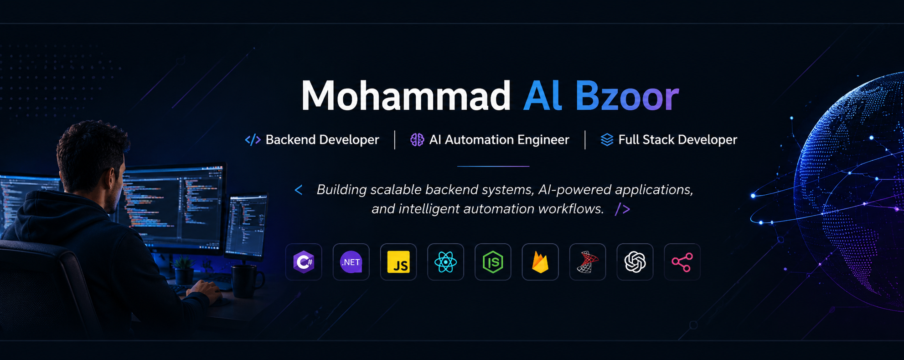

  

<h1 align="center">Mohammad Al Bzoor</h1>

<h3 align="center">
Backend Developer 🛠️ | AI Automation Engineer 🤖 | Full Stack Developer 🌐
</h3>

Building scalable backend systems, AI-powered applications, and intelligent automation workflows.

  

---

# 🌐 Connect With Me

---

# 👨‍💻 About Me

I am a Backend & Full Stack Developer passionate about building scalable systems, AI-powered applications, and intelligent automation workflows.

My experience ranges from developing full-stack web platforms and RESTful APIs to building AI automation systems using modern LLM technologies and workflow orchestration tools.

I also enjoy mentoring and sharing knowledge with the developer community through workshops and technical training sessions.

---

# 🚀 What I'm Currently Working On

- 🤖 AI Automation Systems with N8N
- ⚙️ ASP.NET Core Web APIs
- 🧠 LLM Integrations & AI Agents
- 🌐 Full Stack SaaS Applications
- ☁️ Scalable Backend Architectures
- 🔥 System Design & DevOps

---

# 🛠️ Technical Arsenal

<table align="center">
<tr>

<td align="center" width="33%">

### 🎨 Frontend

</td>

<td align="center" width="33%">

### ⚙️ Backend

</td>

<td align="center" width="33%">

### 🤖 AI & Tools

</td>

</tr>
</table>

---

# 🏆 Experience & Community

- 🎓 Computer Science Student at Al Al-Bayt University
- 👨‍🏫 Delivered a 12-hour Web Basics training course
- 🚀 Participant in Build with AI Hackathon
- 🤖 Experienced in AI Automation & Agentic AI Systems
- 🌍 Passionate about building impactful tech solutions

---

# 🚀 Featured Projects

| Project | Description | Technologies |
|---|---|---|
| 🍽️ Restaurant Management System | Smart restaurant ordering & management platform with admin dashboard and real-time order tracking | React.js, Firebase, Bootstrap |
| 🌐 University Quiz Platform | Interactive educational quiz platform designed for university students | React.js, Firebase |
| 🛒 E-Commerce Store | Full-stack e-commerce application with product management and shopping features | React.js, Firebase, Sass |
| 🤖 AI Automation Systems | AI-powered automation workflows using N8N, APIs, AI Agents, and OpenAI integrations | N8N, OpenAI, APIs |
| ✈️ AIrRoute | AI-powered travel assistant platform developed during Build with AI Hackathon | Gemini API, AI Chatbot, Dataset Optimization |
| ❤️ Donate Platform (تبرّع) | Social impact platform connecting donors with people in need while promoting sustainability | Full Stack Web Technologies |

---

# 📊 GitHub Stats

---

# 💻 Top Languages

---

---

<h3 align="center">
Code. Build. Automate. Scale. 🚀
</h3>
